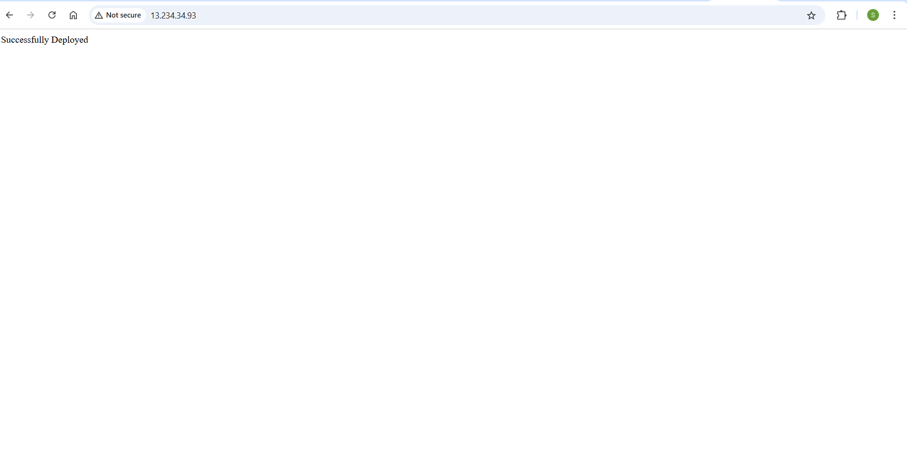

# TechEazyassisment
## ⚙️ Terraform Workflow

This section outlines how to provision infrastructure on AWS using Terraform with support for **multiple environments** via **workspaces** and **`.tfvars` files**.

### 📌 Prerequisites

* Terraform installed (`terraform -v`)
* AWS CLI configured (`aws configure`)
* AWS access keys with EC2 permission
* Valid EC2 AMI ID and key pair (e.g. from Mumbai region)

### 📁 Terraform Files

```
terraform/
├── main.tf
├── variable.tf
├── dev.tfvars
├── prod.tfvars
├──script.sh
```

### 🛠️ Step-by-Step Terraform Flow

#### ✅ 1. Initialize Terraform

```bash
cd terraform/
terraform init
```

#### ✅ 2. Create & Select Workspace (Dev or Prod)

```bash
# Create workspace
terraform workspace new dev

# OR switch to existing
terraform workspace select dev
```

To list workspaces:

```bash
terraform workspace list
```

#### ✅ 3. Plan Infrastructure

```bash
terraform plan -var-file="dev.tfvars"
```

For production:

```bash
terraform workspace select prod
terraform plan -var-file="prod.tfvars"
```

#### ✅ 4. Apply Infrastructure

```bash
terraform apply -auto-approve -var-file="dev.tfvars"
```

#### ✅ 5.  Destroy Infrastructure

```bash
terraform destroy -auto-approve -var-file="dev.tfvars"
```

---

## 🛠️ Build & Deploy Spring Boot App

SSH into the EC2 instance and run:

```bash
## ☕ Install Java 21 and Maven 3.9.10 (Linux/EC2)

```bash
# Update and install tools
sudo yum update -y 
sudo yum install -y wget unzip 
# For Amazon Linux 2:
sudo rpm --import https://yum.corretto.aws/corretto.key
sudo curl -Lo /etc/yum.repos.d/corretto.repo https://yum.corretto.aws/corretto.repo
sudo yum install -y java-21-amazon-corretto

# Maven 3.9.10 installation
cd /opt
sudo wget https://downloads.apache.org/maven/maven-3/3.9.10/binaries/apache-maven-3.9.10-bin.zip
sudo unzip apache-maven-3.9.10-bin.zip
sudo mv apache-maven-3.9.10 apache-maven
sudo ln -s /opt/apache-maven/bin/mvn /usr/bin/mvn

# Verify
java -version
mvn -version

# Clone your repo
git clone https://github.com/techeazy-consulting/techeazy-devops.git
cd repo-name/spring-boot-app

# Build the application
mvn clean install

# Run the JAR
sudo java -jar target/techeazy-devops-0.0.1-SNAPSHOT.jar
```

> The app will run at: `http://13.234.34.93:80/`



  
